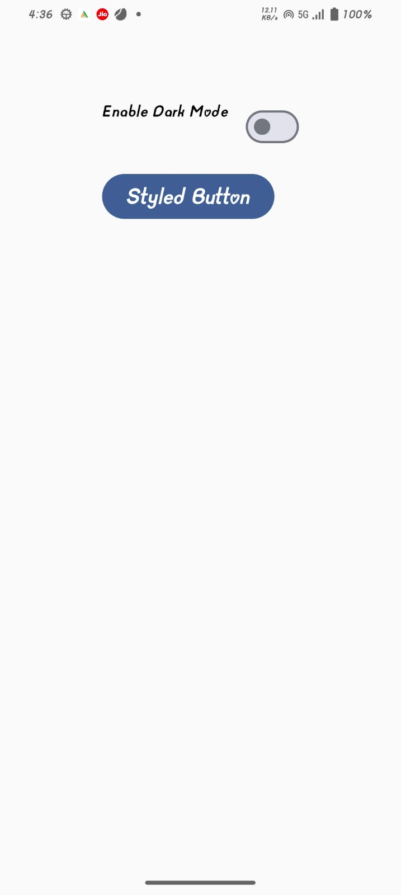
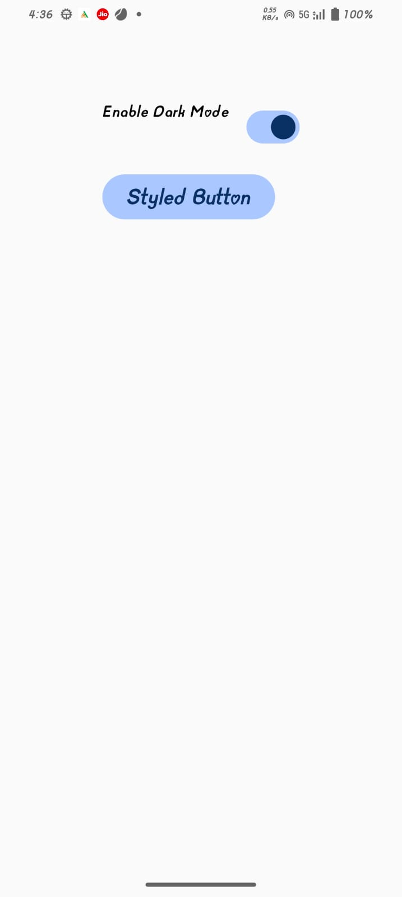

# 🌗 Toggle Theme App

A simple Android app built with Jetpack Compose to practice typography, styles, and colors. The app demonstrates how to toggle between Light Mode and Dark Mode using Compose theming.

# ✨ Features

Toggle between Light and Dark themes

Custom typography and color styles

Built using Material 3 theming

Simple and interactive UI

# screenshots
### INTIAL

### FINAL

# 🛠️ Tech Stack

Kotlin

Jetpack Compose

Material 3 Theme

# 🎯 Purpose

This project was created to learn and practice Jetpack Compose theming concepts, including typography, colors, and style customization.
